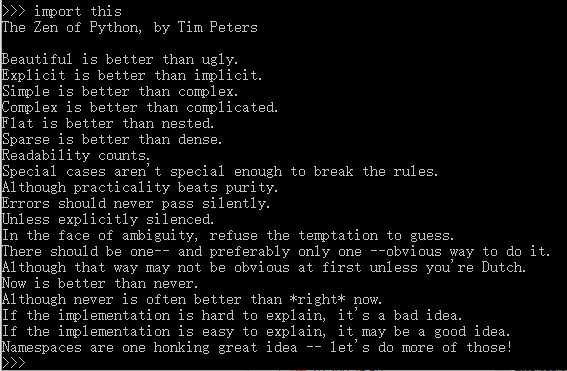

# 了解一下Python？

这里相关Python的全部内容，都基于`Python3.13+`进行说明。

在官网的[https://docs.python.org/3.13/tutorial/appetite.html](https://docs.python.org/3.13/tutorial/appetite.html)这个页面，有这么一段

> By the way, the language is named after the BBC show “Monty Python’s Flying Circus” and has nothing to do with reptiles. Making references to Monty Python skits in documentation is not only allowed, it is encouraged!
>
> 顺便提一句，本语言的命名源自 BBC 的 “Monty Python 飞行马戏团”，与爬行动物无关（Python 原义为“蟒蛇”）。欢迎大家在文档中引用 Monty Python 小品短篇集，多多益善！

也就是说，Python和“蟒蛇”没啥关系，是来自于**巨蟒飞行马戏团**，我特地搜了一下这个飞行团，是一个无厘头的剧团。

开创了新一代无厘头方式。

> https://movie.douban.com/subject/1485976/

不知道**星爷**的无厘头电影，是否借鉴了该剧团的方式。

## Python之禅
Python的哲学，也可以说是原则，遵循以下几条：
1. 简单优雅
2. 尽量写容易看明白的代码
3. 尽量写少的代码

简单来说，符合**优雅、明确、简单**，简单易懂。

在交互式Python中，输入`import this`
```python
import this
```
会出现如下一段话：



## 推荐
1.  [allendowney的ThinkPython](https://allendowney.github.io/ThinkPython/)

## 参考
1. [Python哲学的英文解释](https://inventwithpython.com/blog/2018/08/17/the-zen-of-python-explained/#:~:text=a%20bad%20idea.-,If%20the%20implementation%20is%20easy%20to%20explain%2C%20it%20may%20be,programmers%20who%20maintain%20the%20code)
2. [The Zen of Python](https://peps.python.org/pep-0020/)

