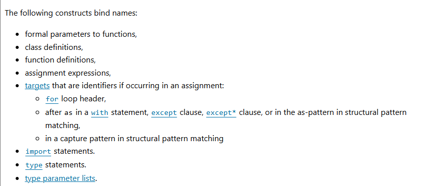
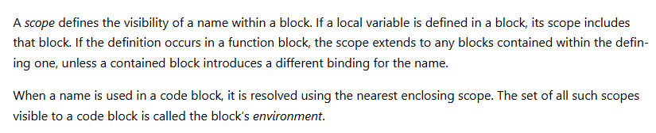
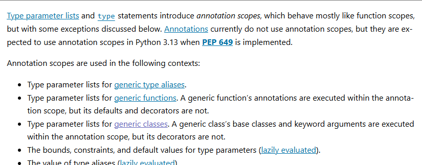

${toc}

关键词：code block、execution frame、naming、binding、scope、environment、namespace 、annotation scopes、lazily evaluated、Exceptions

## 0x01.代码块（code block）

> A block is a piece of Python program text that is executed as a unit. The following are blocks: a module, a function body, and a class definition

代码块（code block），就是一段能被执行的 **文本段**，包括：module、function body、class definition。

每个代码块在一个*运行帧*(execution frame)里执行。

## 0x02.命名(naming)和绑定(binding)

命名(naming)：给object起names(名字)
绑定：将名字和object关联起来

进行命名绑定的地方：

## 0x03.作用域(scope)、环境（environment）、命名空间（namescope）

作用域（scope）：定义了name在block中的visibility （可见）范围。
环境（environment）：一个block中全部的scope
命名空间（namescope）：？

## 0x04. 注释作用域（annotation scopes）

## 0x05. lazily evaluated
？

## 0x08. 异常(Exceptions)
?