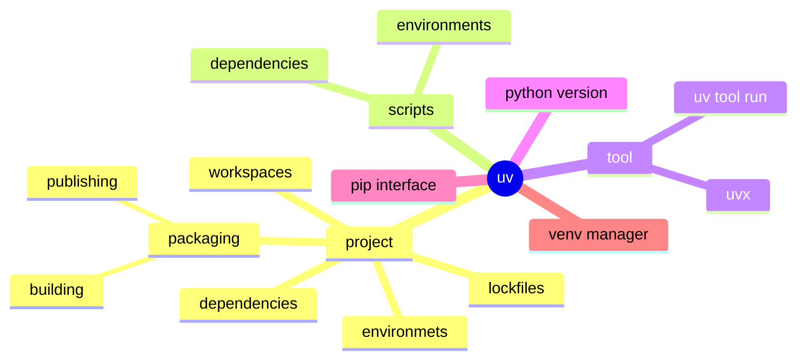

Astral团队：[https://astral.sh/](https://astral.sh/)
uv官网文档：[https://docs.astral.sh/uv/](https://docs.astral.sh/uv/)
ruff官方文档：[https://docs.astral.sh/ruff/](https://docs.astral.sh/ruff/)
ty官方文档：[https://docs.astral.sh/ty/](https://docs.astral.sh/ty/)

官网定义uv是一个：**非常快的Python package and projecte manager（包和项目管理器）**。可以理解成一个Python项目的一站式管家

从文档里也没看出为什么叫`uv`，可能和键盘手指按键有关，`u`和`v` 这两个字母刚好 一个在`j`的上面，一个在`f`的下面，而字母`j`和`f`是键盘手指定位建，按键上一般都有一个小凸起，供**食指**感受。你可能会说，那干脆叫`jf`得了，但和`uv`的组合相比，`jf`一个字母下突出，一个字母上突出，不如`uv`整体协调。当然，这只是我的猜测，具体为啥，得看作者怎么说了。

Window下安装后，会同时安装`uv`、`uvx`、`uvw`，这3个名字，也很有趣



可以分成3部分


## 0x01. Package manager（包管理）
这里的包指 一个python项目最终构建的包，也指 一个 python单独文件构成的模块

### 1. project（项目）
指一个python项目，最终通过构建工具生成一个whl包。uv提供了一套命令，支持从**项目的创建 => 项目的环境管理 => 项目的打包 => 项目包的发布** 全功能的支持

命令列表

|命令|说明|
|---|---|
|uv init project_name|初始化一个项目|
|uv add pakcage_name|添加一个依赖的包|
|uv remove package_name|移除一个依赖的包|
|uv lock --upgrade-package pakcage_name|升级一个依赖包到最新
|uv version --short|查看包的版本信息|
|uv run command_name|运行一个命令|
|uv sync|更新一个项目的环境，并激活该环境|
|uv build|构建一个可发布的whl包|

uv将项目大致分为3类
1. application project（应用类项目）：不打包直接运行的项目
2. packaged application project（打包类应用项目）：以命令行、GUI界面的方式启动的项目
3. library project（Lib项目）：提供通用的依赖库

**应用类项目**的项目结构如下：

```txt
.
├── .venv
│   ├── bin
│   ├── lib
│   └── pyvenv.cfg
├── .python-version
├── README.md
├── main.py
├── pyproject.toml
└── uv.lock
```

直接以`uv run main.py`的方式运行

**打包的应用类项目**、**Lib类项目**的项目结构如下：

```txt
.
├── .venv
│   ├── bin
│   ├── lib
│   └── pyvenv.cfg
├── .python-version
├── README.md
├── pyproject.toml
└── uv.lock
```

这2种项目的区别在`pyproject.toml`文件中，前者有启动入口配置，后者没有该配置


参考官网：[基于项目的使用](https://docs.astral.sh/uv/guides/projects/)


## 0x03. Python enhance（Python增强）

### 1. python version manager（版本管理）
一个版本的python，比如3.13，其中包含`python解释器`、`standard library(标准库文件)`、`other supprting files(其他支持文件)`。

uv可以在系统上管理多个Python version，它可以自动检测系统已经安装的Python，也可以支持下载 指定版本的Python

> 需要注意的一点是，uv是从 `Astral python-build-standalone project`里下载的Python虚拟机。按uv官网说法是，Python官网没有提供Python的可直接安装的虚拟机文件，但Python官网确实提供了download下载页面，里面也有Python虚拟机，参见[Python官网下载](https://www.python.org/downloads/) ，这个目前不知道uv官网为啥这么说

命令列表

|命令|说明|
|---|---|
|uv pyton list|查看已经安装的Python|
|uv python find|查询安装的python版本，默认找到第一个|
|uv python install 3.13 3.12|安装Python的3.13 和 3.12版本|
|uv python install --reinstall|重新安装Python版本|
|uv python upgrade 3.12|将python3.12升级到最新支持的功能，也就是12版本的最新小版本|
|uv python pin|创建一个`.python-version`文件|
|uv python dir|查看python的安装目录|

安装命令将会在`~/.local/bin`目录下创建一个可执行的python启动入口，允许我们在命令行中直接调用`python`

> 如果`~/.local/bin`不在系统的环境变量中，可以使用`uv tool update-shell`命令来进行更新

可以使用`uv python dir`命令来查看python的安装目录，默认是在`~/.local/share/uv/python`目录下

可以通过配置环境更改uv的默认工作目录，如下：

```txt
UV_PYTHON_INSTALL_DIR = /opt/uv/share/python
```

参考官网：[python版本管理](https://docs.astral.sh/uv/concepts/python-versions/)